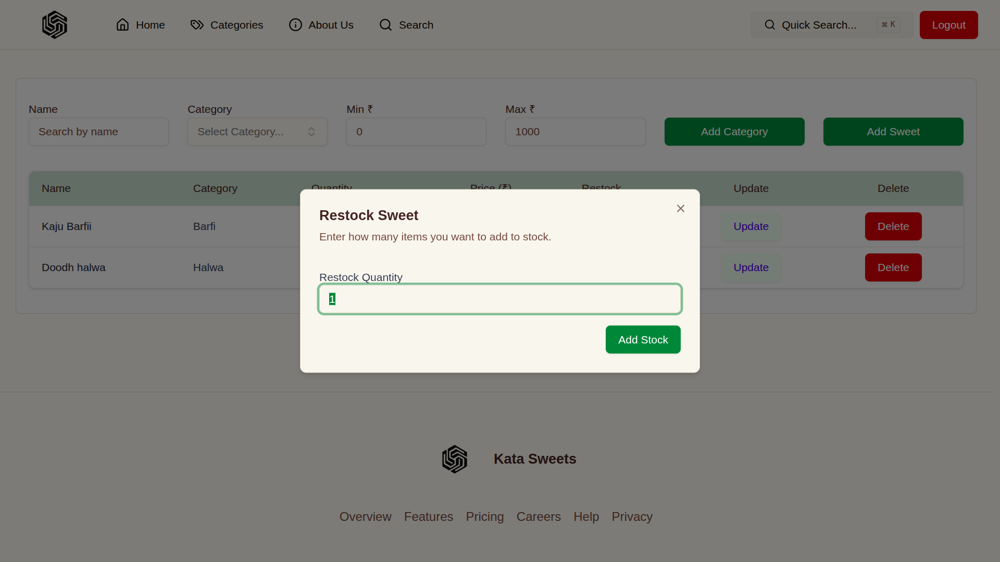

# 🍬 Incubyte Assessment: Sweet Shop Management System

A full-stack **Sweet Shop Management** application built with **FastAPI** and **Next.js**, designed to streamline the daily operations of a sweet shop—inventory tracking, user management, and sweet cataloging—all in one place.

[](https://youtu.be/WqTic5RrKEY)

> 📺 **Click the image above to watch the full demo video.**

---

## 📑 Table of Contents

1. [Overview](#overview)
2. [Project Setup](#project-setup)
3. [Environment Variables](#environment-variables)
4. [Tech Stack](#tech-stack)
5. [API Reference](#api-reference)
6. [AI Tools Used](#ai-tools-used)
7. [Test Report](#test-report)
8. [Screenshots](#screenshots)

---

## 📌 Overview

This project is a coding kata that challenges you to build a full-stack Sweet Shop Management System. It involves:

- API development with FastAPI
- MongoDB integration using Beanie ODM
- Frontend implementation using Next.js and Shadcn UI
- Authentication with JWT
- Role-based access (Admin/User)
- Full test coverage using Pytest
- AI-assisted development to boost productivity and code quality

This project is ideal for honing full-stack development skills, DevOps practices, and clean code principles.

---

## 🚀 Project Setup

### ✅ Prerequisites

- **Node.js**
- **Python 3.12+**
- **Poetry** (Python dependency manager)

### 🔧 Installation Steps

1. **Clone the Repository**

```bash
git clone https://github.com/aj045045/Incubyte_Assessment_Sweet_Shop.git
cd Incubyte_Assessment_Sweet_Shop
```

2. **Install Client Dependencies**

```bash
cd client
npm install
```

3. **Install Server Dependencies**

```bash
cd ../server
pip install poetry
poetry config virtualenvs.create false
poetry install
```

4. **Run the Application**

```bash
# Run frontend
cd ../client
npm run build && npm run start

# Run tests
cd ../server
poetry run pytest

# Start backend server
poetry run uvicorn src.main:app --reload --host 0.0.0.0 --port 8000
```

### 🧪 Admin Credentials

```txt
Email: admin@example.com
Password: Password@123
```

---

## 🔐 Environment Variables

Create a `.env` file in the `server/` directory with the following:

```env
MONGO_DB=<your_database_name>
MONGO_URI=<your_mongodb_uri>
SECRET_KEY=<your_jwt_secret>
ALGORITHM=<jwt_algorithm>
ACCESS_TOKEN_EXPIRE_MINUTES=<token_expiry_time>
```

---

## 🧰 Tech Stack

### Frontend

- [Next.js](https://nextjs.org/)
- [Shadcn UI](https://ui.shadcn.com/)
- [SWR](https://swr.vercel.app/)
- [React Hook Form](https://react-hook-form.com/)
- [Zod](https://zod.dev/) – Schema validation

### Backend

- [FastAPI](https://fastapi.tiangolo.com/)
- [Beanie ODM](https://roman-right.github.io/beanie/) for MongoDB
- [JWT](https://jwt.io/) Authentication
- [Pytest](https://docs.pytest.org/) for testing

---

## 📡 API Reference

### 🔐 Auth

| Method | Endpoint             | Description        | Access |
| ------ | -------------------- | ------------------ | ------ |
| POST   | `/api/auth/register` | Register new user  | Public |
| POST   | `/api/auth/login`    | Login (User/Admin) | Public |

### 🍭 Sweets (Protected)

| Method | Endpoint                 | Description                          | Access |
| ------ | ------------------------ | ------------------------------------ | ------ |
| POST   | `/api/sweets`            | Add a sweet                          | Admin  |
| GET    | `/api/sweets`            | View all sweets                      | Both   |
| GET    | `/api/sweets/search`     | Search sweets by name/category/price | Both   |
| PUT    | `/api/sweets/:id`        | Update sweet details                 | Admin  |
| DELETE | `/api/sweets/:id`        | Delete a sweet                       | Admin  |
| POST   | `/api/sweets/categories` | Add a sweet category                 | Admin  |
| GET    | `/api/sweets/categories` | Get all sweet categories             | Both   |

### 📦 Inventory (Protected)

| Method | Endpoint                   | Description      | Access |
| ------ | -------------------------- | ---------------- | ------ |
| POST   | `/api/sweets/:id/purchase` | Purchase a sweet | User   |
| POST   | `/api/sweets/:id/restock`  | Restock a sweet  | Admin  |

---

## 🤖 AI Tools Used

- **ChatGPT**: Refactored test cases and resolved backend logic bugs.
- **Mintlify Doc Writer**: Auto-generated clean, readable documentation from code.

These tools significantly improved development speed and code maintainability.

---

## ✅ Test Report

```
============================= test session starts ==============================
Platform: Linux | Python 3.12.11 | pytest-8.4.1
RootDir: /Incubyte/server
Tests: 14 total (auth, inventory, sweets)

Results:
tests/test_auth.py ..........        [ 42%]
tests/test_inventory.py ....        [ 64%]
tests/test_sweets.py ......          [100%]

============================== 14 passed in 5.99s ==============================
```
```
================================ tests coverage ================================
_______________ coverage: platform linux, python 3.12.11-final-0 _______________

Name                        Stmts   Miss  Cover
-----------------------------------------------
src/main.py                    14      4    71%
src/models/__init__.py          3      0   100%
src/models/category.py          6      0   100%
src/models/sweets.py           10      0   100%
src/models/users.py             9      0   100%
src/routes/auth.py             29      0   100%
src/routes/sweets.py          102     15    85%
src/schemas/__init__.py         0      0   100%
src/schemas/response.py         8      0   100%
src/schemas/sweets.py          17      0   100%
src/schemas/token.py            4      0   100%
src/schemas/user_login.py       4      0   100%
src/utils/__init__.py           0      0   100%
src/utils/auth.py              27      3    89%
src/utils/db.py                 8      3    62%
src/utils/env.py               11      0   100%
src/utils/password.py           6      0   100%
-----------------------------------------------
TOTAL                         258     25    90%
============================== 14 passed in 7.18s ==============================

```

---

## 🖼️ Screenshots

Here are some snapshots of the Sweet Shop Management System in action:

> 🎥 **[Click here to view the full demo video](https://youtu.be/WqTic5RrKEY)** \
> A walkthrough of the system—from login to sweet inventory management.

### 🔐 Authentication

**Login Page**


**Sign Up Page**


---

### 🏠 Home Screens (User View)

**Home View 1**


**Home View 2**


**Home View 3**


**Home View 4**


---

### 👤 Admin Dashboard

**Admin Dashboard 1**


**Admin Dashboard 2**


**Admin Dashboard 3**


**Admin Dashboard 4**



**Admin Dashboard 5**


**Admin Dashboard 6**


**Admin Dashboard 7**


---

### 👥 User Dashboard

**User View 1**


**User View 2**


---

> 🎥 **Demo Video**
> Watch a full walkthrough of the Sweet Shop Management System in action—from login to inventory updates.

🔗 [Click here to view the demo video](https://youtu.be/WqTic5RrKEY)
